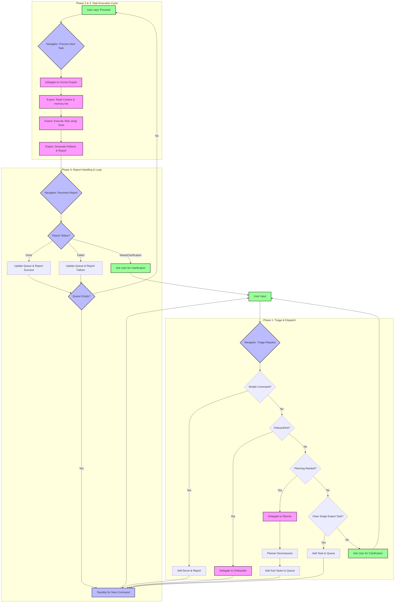

# Rooroo System Architecture & Operational Workflow (Detailed)

This document provides a comprehensive overview of the Rooroo system architecture, detailing its core philosophy, expert roles, standardized file system, and the complete operational workflow from task inception to completion.

## 1. Core Philosophy: Expert-Based Agency

Rooroo operates on an "Expert-Based Agency" model. It is designed to tackle complex software development and project management tasks by delegating work to a suite of specialized AI "experts." Each expert possesses a unique skill set and operates under a strict set of directives. This model ensures that every aspect of a task is handled by the most qualified agent, promoting efficiency, quality, and modularity.

The system is governed by three foundational principles:
- **Structured Operation:** All actions, communications, and data artifacts adhere to a predefined protocol. This ensures predictability and traceability.
- **Principle of Least Assumption:** The system is explicitly forbidden from guessing user intent. When ambiguity arises, it must seek clarification.
- **Transparent Execution:** All operations are logged, and the system communicates its state and actions clearly to the user, fostering trust and enabling oversight.

## 2. The Rooroo File System: The System's Backbone

A standardized directory structure within the project's `.rooroo/` folder is critical for state management and inter-expert communication.

- **`.roomodes` (YAML/JSON):** The master configuration file defining all available expert modes. It contains each expert's `slug`, display `name`, `roleDefinition`, `whenToUse` criteria, and most importantly, their extensive `customInstructions`.
- **`.rooroo/memory.md`:** The **Shared Project Memory**. This critical file is generated by the `Onboarder` expert upon project initialization. It contains project-specific build/test/lint commands, coding style conventions, key dependencies, and architectural notes. **ALL experts are mandated to read this file before executing any task** to ensure their actions are consistent with the project's unique environment.
- **`.rooroo/queue.jsonl`:** The **Task Queue**. A JSON Lines file where each line represents a single, self-contained task object waiting for execution. It is managed exclusively by the `Navigator` on a First-In, First-Out (FIFO) basis.
- **`.rooroo/logs/activity.jsonl`:** The **Global Activity Log**. An append-only log that serves as the immutable record of all significant system events, including task creation, delegation, expert reports, and errors.
- **`.rooroo/tasks/{TASK_ID}/`:** A **Task-Specific Workspace**. Each task is assigned a unique ID and a corresponding directory.
    - `context.md`: A concise markdown file prepared by the `Navigator` or `Planner`. It outlines the task goal and provides **links** to relevant project files or previous artifacts. It strictly forbids embedding large code blocks to keep context focused. It must also link to the shared `memory.md`.
    - `...artifacts`: Any files generated by the expert during task execution, such as analysis reports, code drafts, or design mockups, are stored here.
- **`.rooroo/plans/`:** A directory where the `Planner` expert stores its detailed `plan_overview.md` files for complex, multi-step tasks.
- **`.rooroo/brainstorming/`:** A directory for the `Idea Sparker` to save summaries of its interactive brainstorming sessions with the user.

## 3. Expert Roles and Responsibilities

The system's power lies in its diverse roster of experts.

| Slug | Name | Core Responsibility & Function |
| :--- | :--- | :--- |
| `rooroo-navigator` | 🧭 **Navigator** | The **System Orchestrator**. It is the primary user interface, managing the main event loop. It triages all incoming requests, manages the task queue, dispatches tasks to other experts, processes their reports, and maintains clear communication with the user. |
| `rooroo-planner` | 🗓️ **Planner** | The **Master Strategist**. Invoked for complex goals that require multiple expert skills. It decomposes the goal into a sequence of smaller, actionable sub-tasks, assigns the appropriate expert to each, and creates a comprehensive execution plan. |
| `rooroo-developer` | 🧑‍💻 **Developer** | The **Engineering Virtuoso**. Writes, modifies, debugs, and refactors code. It implements features and is responsible for creating high-quality, modern UI. It must hand off tasks requiring significant new design to the `Designer`. |
| `rooroo-designer` | 🎨 **Designer** | The **Visual Architect**. Specializes in UI/UX design. Creates high-fidelity mockups, user flows, and visual style guides. Its outputs are detailed blueprints for the `Developer` to implement. |
| `rooroo-analyzer` | 📊 **Analyzer** | The **Insightful Investigator**. Conducts deep analysis of codebases, log files, or other data sources. It uses a combination of search and read tools to gather evidence and produces structured, evidence-based reports. |
| `rooroo-documenter`| ✍️ **Documenter** | The **Clarity Craftsman**. Creates, updates, and improves all forms of documentation, from READMEs and API guides to inline code comments, ensuring clarity and accuracy. |
| `rooroo-onboarder` | 👣 **Onboarder** | The **Project Analyst**. Its sole purpose is to initialize a new project by scanning the entire codebase and generating the crucial `.rooroo/memory.md` file, establishing a shared context for all other experts. |
| `rooroo-idea-sparker`| 💡 **Idea Sparker**| The **Innovation Catalyst**. Facilitates interactive brainstorming sessions with the user, using a question-driven approach to explore ideas, challenge assumptions, and synthesize creative solutions. |
| `rooroo-prompt-architect`| 📝 **Prompt Architect**| The **Expert Designer**. A meta-expert that guides the user in creating new, custom Rooroo expert modes by transforming a simple idea into a fully-structured set of operational instructions. |

## 4. The Operational Workflow: A Step-by-Step Guide

The entire Rooroo process is a stateful loop managed by the `Navigator`.

### Phase 1: Task Triage & Dispatch (Navigator)

1.  **Request Ingestion**: The `Navigator` receives a prompt from the user.
2.  **Triage Logic**: It evaluates the request against a strict, ordered set of rules:
    *   **A. Self-Service**: For simple, read-only commands (`"show logs"`, `"read file"`), the `Navigator` executes them directly.
    *   **B. Onboarding**: If the user requests project initialization (`"/init"`, `"onboard"`), it immediately switches to the `Onboarder` mode.
    *   **C. Brainstorming**: If the user requests brainstorming, it switches to the `Idea Sparker`.
    *   **D. "Proceed" Command**: If the user says `"proceed"`, the `Navigator` initiates Phase 2 to process the next task in the queue.
    *   **E. Planning Needed**: If the request is complex, vague, or clearly requires multiple experts (e.g., "Build a new feature and document it"), it delegates to the `Planner`. The `Planner`'s output (a list of sub-tasks) is then added to the queue.
    *   **F. Queue Single Task (Default)**: If the request is a clear, self-contained task for a single expert (e.g., "Refactor the `utils.ts` file"), the `Navigator` creates a task object and appends it to `.rooroo/queue.jsonl`. It then informs the user that the task has been queued.
    *   **G. Conversational**: If the input is non-actionable (`"thanks"`, `"ok"`), it acknowledges and waits.
    *   **H. Ambiguous**: If the request cannot be confidently categorized, the `Navigator` uses the `<ask_followup_question>` tool to request specific clarification from the user. It will not proceed until the ambiguity is resolved.

### Phase 2: Queued Task Processing (Navigator)

1.  **Dequeue**: The `Navigator` reads the first task from `.rooroo/queue.jsonl`.
2.  **Validate**: It validates that the task specifies a valid expert mode.
3.  **Delegate**: It constructs a formal command message and uses the `<new_task>` tool to invoke the designated expert, passing the task's goal and context file.
4.  **Update Queue**: It transitions to Phase 3, awaiting the expert's report. The task is conceptually "in-flight".

### Phase 3: Expert Execution

1.  **Context Ingestion**: The invoked expert (e.g., `Developer`) starts by reading its `context.md` file and, critically, the shared `.rooroo/memory.md`.
2.  **Tool-Based Execution**: The expert uses its authorized set of tools (`<read_file>`, `<apply_diff>`, `<execute_command>`, etc.) to perform the work.
3.  **Artifact Generation**: All outputs (modified files, new reports) are saved to their designated paths.
4.  **Reporting**: Upon completion, the expert generates a final JSON report with a `status` (`Done`, `Failed`, or `NeedsClarification`), a summary `message`, and a list of `output_artifact_paths`. This report is sent back to the `Navigator`.

### Phase 4: Report Processing & Loop Continuation (Navigator)

1.  **Receive Report**: The `Navigator` parses the expert's JSON report.
2.  **Handle Status**:
    *   **`Done`**: The `Navigator` logs the success, removes the task from the queue by rewriting the `queue.jsonl` file with the remaining tasks, and informs the user of the completion and the location of the artifacts.
    *   **`Failed`**: The task is removed from the queue, and the `Navigator` reports the failure and error details to the user.
    *   **`NeedsClarification`**: The `Navigator` presents the expert's question to the user. The task is typically re-queued or held in a pending state until the user provides the necessary information.
3.  **Standby**: The `Navigator` returns to a standby state, informing the user of the current status (e.g., "Ready for your command." or "Ready. 'Proceed' for {X} queued tasks."). The loop is now ready to start again from Phase 1.
---

## 5. System Workflow Diagram (Mermaid)

This flowchart illustrates the primary operational loop of the Rooroo system, managed by the `Navigator`. This version has been corrected for syntax and completeness.

